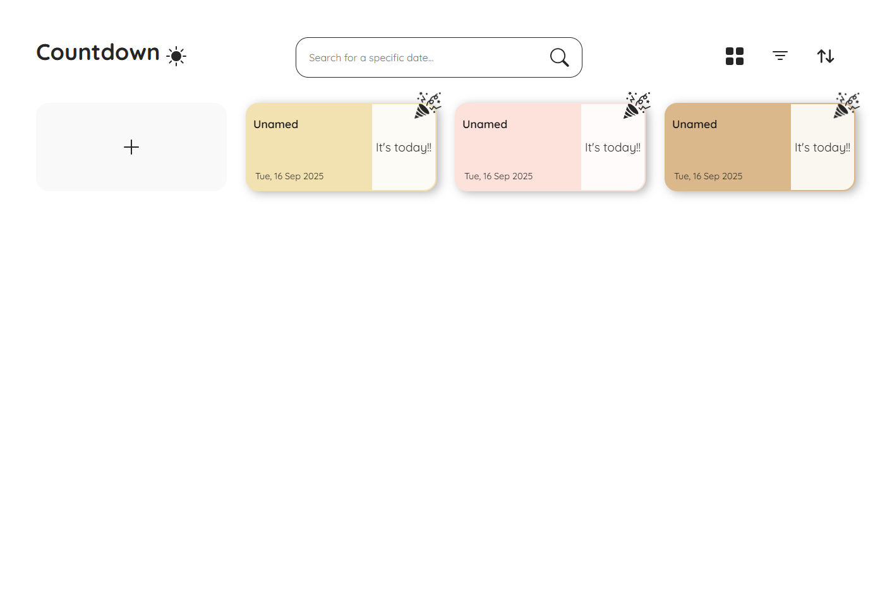
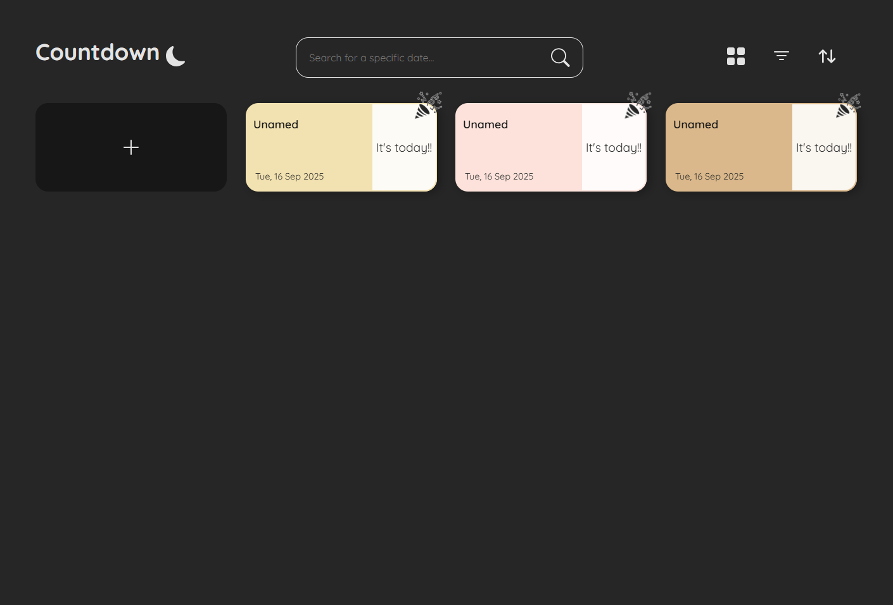

# countdown

This is a web app made with React.js to keep on track countdown of important events.

🐨 A work in progress...

<div align="center">
  
  
  
</div>

<div align="center">
  
  
  
</div>

## Features

- [x] Filter
- [x] Sort
  - [x] By day
  - [x] By color
  - [x] By alphabet
- [x] View
  - [x] Grid
  - [x] List
- [x] Themes
  - [x] Light
  - [x] Dark

## Tools


## Project Setup

```sh
npm install
```

### Compile and Hot-Reload for Development

```sh
npm run dev
```

### Compile and Minify for Production

```sh
npm run build
```

## License

[MIT](./License.md)
